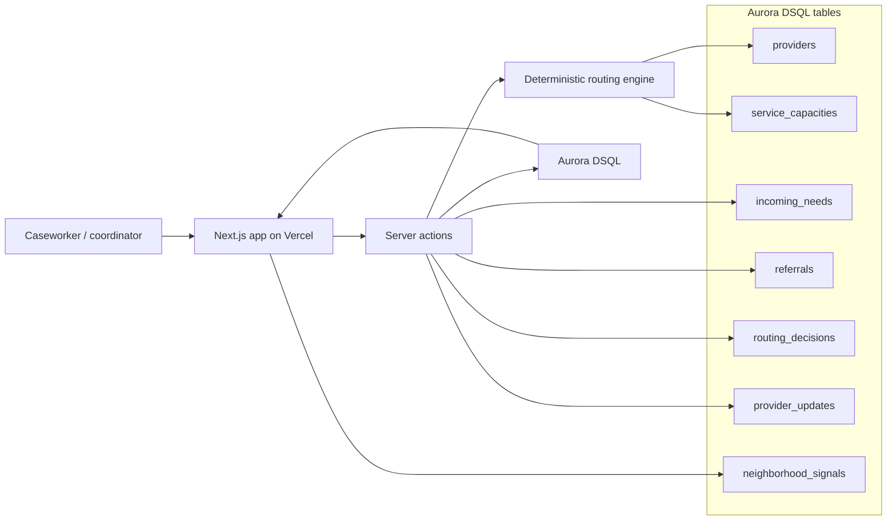

# Civic Pulse

Civic Pulse is an emergency routing desk for mutual aid teams, nonprofits, and city partners. It turns incoming community needs and live provider capacity into explainable, auditable referrals so people are not sent to help that is already full, stale, or mismatched.

Live app: https://h01-hackathon.vercel.app/

## What it does

- Tracks incoming needs during an active incident.
- Scores providers with deterministic, explainable routing logic.
- Creates referrals from selected incoming needs.
- Updates provider capacity after a handoff.
- Records routing decisions and audit events in Aurora DSQL.
- Includes a simulation button that adds realistic incoming requests through the same database-backed workflow.

The current data is synthetic, but the workflow is built around normal database records. Real intake sources such as 211 exports, shelter check-ins, SMS intake, forms, or provider portals can feed the same `incoming_needs` table.

## Demo flow

1. Open the incident routing desk.
2. Select an incoming need from the queue.
3. Review the recommended provider and backup routes.
4. Route the referral.
5. Watch the incoming need move out of the queue, provider capacity update, and the audit trail record the handoff.
6. Use `Simulate request` to insert another realistic incoming need.

## Architecture



More detail is in [docs/architecture.md](docs/architecture.md).

## Tech stack

- Next.js 15 and React 19
- Vercel deployment
- Aurora DSQL for persistence
- Drizzle ORM with `postgres`
- AWS DSQL signer support for token-based local/server connections
- TypeScript routing engine with deterministic scoring

## Routing model

Routing is deterministic by design. Providers are scored by:

- service type match
- available capacity
- provider status
- neighborhood match
- urgency fit
- constraints such as no vehicle

The UI displays the reasons behind each recommendation so the coordinator can review the decision before routing.

## Local development

Install dependencies:

```bash
npm install
```

Run without a database, using the built-in demo fallback:

```bash
CIVIC_PULSE_FORCE_DEMO=1 npm run dev
```

Run with Aurora DSQL by setting one of these connection modes:

```bash
DATABASE_URL="postgres://..."
```

or:

```bash
DSQL_HOST="your-cluster.dsql.us-east-1.on.aws"
DSQL_REGION="us-east-1"
AWS_PROFILE="your-sso-profile"
```

Then start the app:

```bash
npm run dev
```

## Database

Push schema changes:

```bash
npm run db:push
```

Seed demo data:

```bash
npm run db:seed
```

Core tables:

- `providers`
- `service_capacities`
- `incoming_needs`
- `referrals`
- `routing_decisions`
- `provider_updates`
- `neighborhood_signals`

## Verification

```bash
npm run typecheck
npm run lint
npm run build
```
