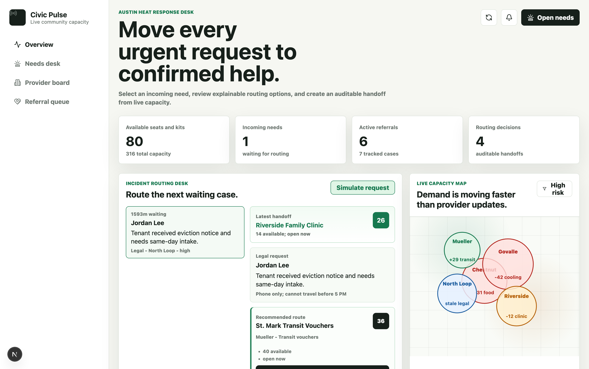
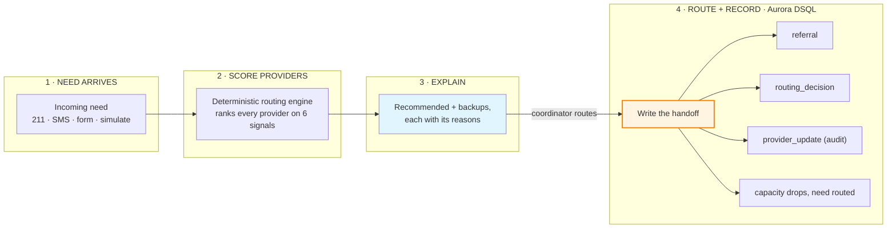
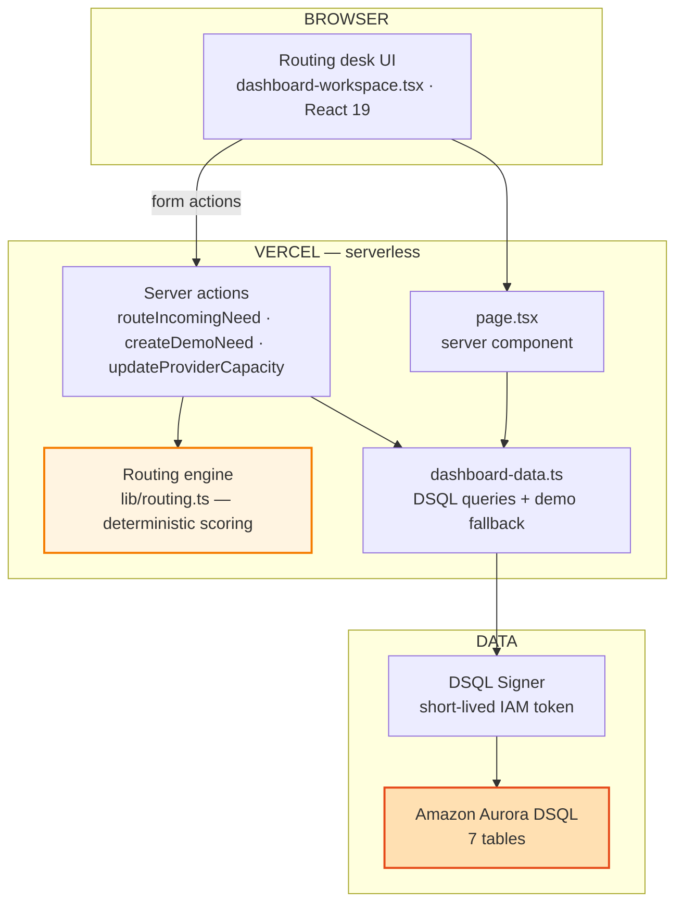
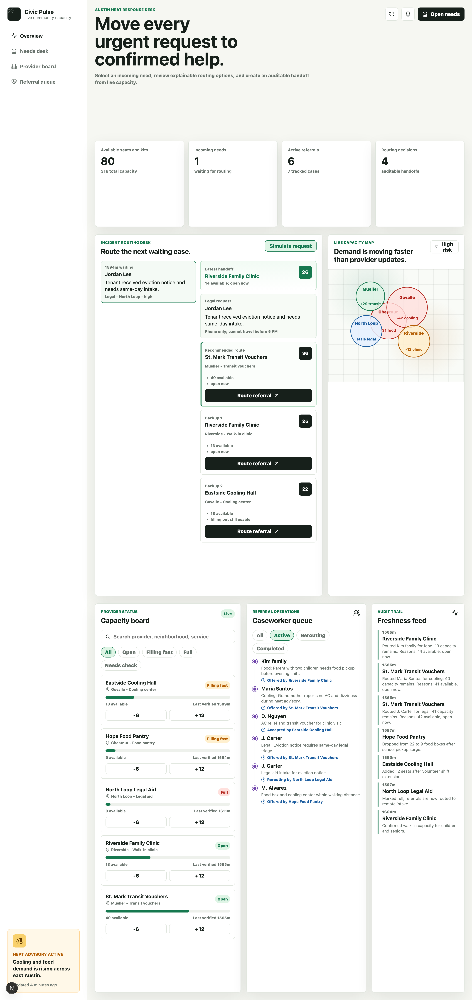
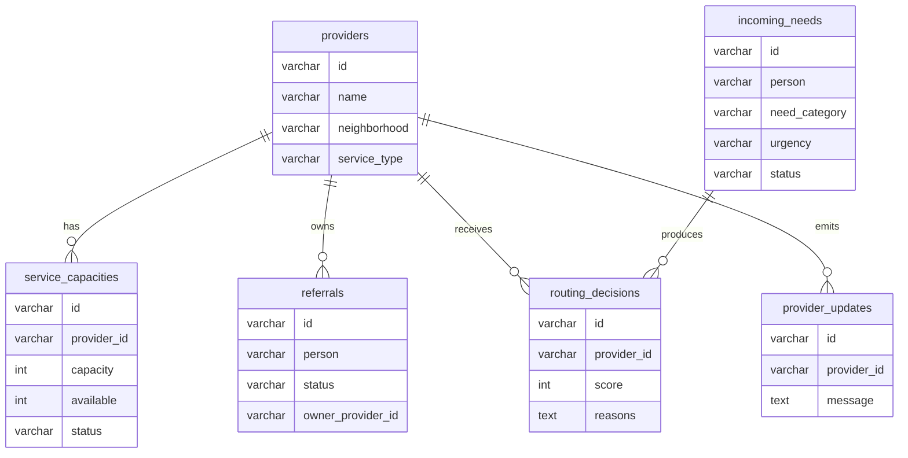

# Civic Pulse — Explainable Emergency Routing for Mutual Aid

**Built with:** Next.js 15 · React 19 · Amazon Aurora DSQL · Drizzle ORM · postgres.js · AWS DSQL Signer (IAM auth) · Vercel · TypeScript · deterministic routing engine · MIT licensed

[](https://nextjs.org/)
[](https://react.dev/)
[](https://aws.amazon.com/rds/aurora/dsql/)
[](https://orm.drizzle.team/)
[](https://h01-hackathon.vercel.app/)
[](https://www.typescriptlang.org/)
[](LICENSE)

**Live app:** https://h01-hackathon.vercel.app/




> **A referral list tells you who *exists*. Civic Pulse tells you who can *actually help right now* — and shows its work.**
> It doesn't replace coordinators. It makes sure no one is routed to help that's already full, stale, or mismatched — and writes every decision to Aurora DSQL.

Civic Pulse is a **low-cost, explainable emergency routing desk** for mutual-aid teams, nonprofits, and city partners. During an active incident it turns a stream of incoming community needs and **live provider capacity** into ranked, auditable referrals. For each need, a deterministic engine scores every provider on service match, neighborhood, available capacity, freshness, urgency, and hard constraints — then surfaces the recommended site and backups **with the reasons behind each one**. Routing a referral writes the handoff to **Amazon Aurora DSQL**, decrements capacity, and records an audit event, so the next decision sees the new reality.

The demo data is synthetic, but the workflow runs on ordinary database records. Real intake — 211 exports, shelter check-ins, SMS, forms, provider portals — feeds the same `incoming_needs` table.

*H0: Hack the Zero Stack with Vercel v0 and AWS Databases — Open Innovation.*

## Quick Highlights

- **The database *is* the product.** Every need, provider, capacity change, referral, routing decision, and audit event is a row in **Aurora DSQL**. This isn't a UI with a database bolted on — the live state and the audit trail are the same data, and any real intake source can write to it.
- **Explainable by construction.** Routing is a deterministic score over six signals (`src/lib/routing.ts`, unit-testable) — **no LLM in the decision path**. Every recommendation ships with its plain-language reasons, so a coordinator can audit the call *before* routing a person.
- **It answers the question a directory can't** — not "is there a cooling center in Govalle?" but "which *open* site can take *this* person, given their neighborhood, urgency, and that they have no vehicle — and why?"
- **Capacity is live, and routing respects it.** A site at zero availability is penalized -80; routing a referral decrements its capacity and writes an audit row, so a full site stops being recommended the moment it fills.
- **Passwordless database auth.** No static DB credential anywhere. The app mints a short-lived **IAM auth token** per connection via the AWS DSQL Signer (cached ~50 min) — your AWS SSO profile locally, a least-privilege IAM role on Vercel.
- **Serverless to the core.** Next.js server actions on Vercel + Aurora DSQL: nothing to run between incidents (scales to zero), and the same operationally-proven data foundation a production deployment would use.
- **Runs with or without a database.** `CIVIC_PULSE_FORCE_DEMO=1` serves a built-in seed-file so the UI is demoable offline; point it at DSQL and the exact same screens read live rows.

## Architecture

### High-level workflow



### System architecture



### Tech stack

| Layer | Technology | Purpose |
|---|---|---|
| **Database** | Amazon **Aurora DSQL** (serverless, active-active Postgres) | system of record — providers, capacity, needs, referrals, decisions, audit |
| **Database auth** | AWS DSQL Signer (`@aws-sdk/dsql-signer`) | short-lived IAM auth tokens — no static password; SSO locally, IAM role on Vercel |
| **ORM / driver** | Drizzle ORM + postgres.js | typed schema and queries over DSQL |
| **Routing engine** | TypeScript, deterministic scoring | ranks providers by 6 explainable signals — no model in the path |
| **App / API** | Next.js 15 (App Router + server actions) + React 19 | the routing desk UI and the mutations, one framework |
| **Deployment** | Vercel | serverless hosting + server actions, scales to zero |
| **Schema / seed** | drizzle-kit + tsx scripts (DSQL-token aware) | `db:push`, `db:seed`, `db:check` against DSQL |

## The Problem

In a crisis, mutual-aid and nonprofit coordinators route people from static lists and group chats. The result: someone is sent to a cooling center that filled up an hour ago, a pantry across town they can't reach without a car, or a clinic whose hours are stale. The information to make the right call exists — it's just scattered, out of date, and never explained.

- **Capacity changes by the minute.** A printed or spreadsheet list is wrong the moment it's shared.
- **"Nearest" isn't "reachable."** A referral two neighborhoods away is useless to someone with no vehicle.
- **Severity isn't fit.** The most urgent case still needs an *open* site that matches the actual need.
- **Failed handoffs leave no trace.** There's no audit trail of who was sent where, or why, to learn from.

## The Solution

Civic Pulse sits between intake and the coordinator and turns the scattered list into a live, auditable routing desk backed by Aurora DSQL. For each incoming need it:

1. **Loads** every provider and its **live capacity** from DSQL.
2. **Scores** each provider with a deterministic engine — service match, neighborhood, available capacity, freshness, urgency fit, and hard constraints like "no vehicle."
3. **Surfaces** the recommended provider and ranked backups, each annotated with the reasons behind its score.
4. **Records** the decision — on route, it writes the `referral`, the `routing_decision`, and a `provider_update` audit event to DSQL, decrements the provider's capacity, and moves the need out of the queue, so the next decision sees the new reality.

The engine adds the three things a directory doesn't have: a **live capacity model**, **explainable scoring**, and a **written audit trail**.




## The Core Logic (transparent rules, no black box)

### Routing score — what makes a provider the right call

Every provider is scored for the specific need; highest score wins, and the same signals become the human-readable "reasons" (`src/lib/routing.ts`):

| Signal | Effect on score | Why it matters |
|---|---|---|
| **Service-type match** | **+45** | a cooling need has to go to a cooling site |
| **Same neighborhood** | **+22** | walkable / reachable matters most in a crisis |
| **Available capacity** | **+1 per open seat (cap +24)**; **-80 if none** | never route to a site with no room |
| **Status** open / filling / stale / full | **+12 / +4 / -16 / -50** | fresh, open sites win; stale and full are penalized |
| **Critical urgency at an open site** | **+8** | the hardest cases go to ready capacity |
| **"No vehicle" + local or transit provider** | **+8** | honor the constraint the person actually has |

### Live status, derived from capacity

A provider's `status` is computed from its live capacity, not set by hand: **`full`** at 0 available, **`filling`** at ≤ 25% remaining, otherwise **`open`** (`src/app/actions.ts`). The engine reads it on every routing pass, so freshness and fullness feed straight back into the next recommendation.

## Example output

For a real incoming need, the desk ranks every provider and shows its reasoning. Routing the top choice writes the handoff to DSQL and updates live capacity.

---

**Civic Pulse — routing for Maria Santos** · Cooling · Govalle · critical · *no vehicle, can walk short distance*

| Rank | Provider | Score | Why | Capacity |
|---|---|---|---|---|
| **1** | **Eastside Cooling Hall** (Govalle) | **97** | matches cooling need · same neighborhood · 18 available · filling but usable · works with no-vehicle constraint | 18 / 80 · filling |
| 2 | St. Mark Transit Vouchers (Mueller) | 52 | 42 available · open now · works with no-vehicle constraint | 42 / 60 · open |
| 3 | Riverside Family Clinic (Riverside) | 34 | 14 available · open now · fits critical handoff | 14 / 36 · open |

<details><summary>Filtered: no usable capacity</summary>

| Provider | Score | Reason |
|---|---|---|
| North Loop Legal Aid (North Loop) | -130 | no current capacity · currently full |

</details>

**On route:** `referral` + `routing_decision` + audit row written to DSQL · Eastside capacity drops **18 to 17** · need goes **open to routed** · audit: *"Routed Maria Santos for cooling; 17 capacity remains."*

---

## Demo flow

```mermaid
sequenceDiagram
    participant C as Coordinator
    participant App as Next.js (Vercel)
    participant Eng as Routing engine
    participant DSQL as Aurora DSQL
    C->>App: select an incoming need
    App->>DSQL: load providers + live capacity
    App->>Eng: score every provider for this need
    Eng-->>App: ranked list + reasons
    App-->>C: recommended + backups (explained)
    C->>App: route the referral
    App->>DSQL: write referral, decision and audit; decrement capacity, mark need routed
    App-->>C: queue updates, capacity drops, audit trail grows
```

1. Open the incident routing desk.
2. Select an incoming need from the queue.
3. Review the recommended provider and backup routes — and the reasons.
4. Route the referral.
5. Watch the need leave the queue, capacity update, and the audit trail record the handoff.
6. Use **Simulate request** to insert another realistic need through the same DSQL-backed workflow.

## Why Aurora DSQL

Civic Pulse uses **Amazon Aurora DSQL** as its single system of record — the choice is deliberate, not incidental:

- **Serverless + active-active.** Scales to zero between incidents and scales out under a surge — the exact operating profile of disaster response, with no servers to manage.
- **Postgres-compatible.** Standard SQL through Drizzle + postgres.js — no proprietary client, no lock-in.
- **IAM authentication, no stored passwords.** The app mints short-lived auth tokens via the DSQL Signer; production uses a scoped IAM role limited to `dsql:DbConnectAdmin` on this one cluster.
- **State and audit are one.** Because every action is a DSQL row, the live operational view and the audit log come from the same place — no separate event store to reconcile.

**Tables:** `providers` · `service_capacities` · `incoming_needs` · `referrals` · `routing_decisions` · `provider_updates` · `neighborhood_signals`



The DSQL connection is in [`src/db/client.ts`](src/db/client.ts): it builds a `DsqlSigner` token, caches the pooled client for ~50 minutes, and connects over TLS. Set `CIVIC_PULSE_FORCE_DEMO=1` (or provide no DSQL config) and the same screens fall back to a built-in seed-file via [`src/lib/demo-data.ts`](src/lib/demo-data.ts).

## Project structure

```text
civic-pulse/
├── src/
│   ├── app/
│   │   ├── page.tsx                  # server component — loads dashboard data
│   │   ├── dashboard-workspace.tsx   # the routing desk UI (React 19)
│   │   ├── actions.ts                # server actions — route, simulate, update capacity
│   │   └── layout.tsx · globals.css · page.module.css
│   ├── db/
│   │   ├── client.ts                 # DSQL connection — IAM token via DsqlSigner, cached
│   │   └── schema.ts                 # Drizzle schema — the 7 tables
│   └── lib/
│       ├── routing.ts                # the deterministic routing engine (the heart of the product)
│       ├── dashboard-data.ts         # DSQL queries + demo fallback
│       └── demo-data.ts              # offline seed-file fallback
├── scripts/
│   ├── seed.ts                       # seed DSQL (DATABASE_URL or DSQL IAM token)
│   ├── dsql-token.ts                 # mint a DSQL auth token (for drizzle-kit push)
│   └── dsql-check.ts                 # inspect DSQL tables + row counts
├── docs/architecture.md              # architecture & design deep-dive
├── drizzle.config.ts                 # drizzle-kit — DSQL-aware (token or URL)
└── package.json · tsconfig.json · next.config.mjs · eslint.config.mjs · LICENSE
```

## Quick Start

### Self-contained — no database, no AWS

```bash
npm install
CIVIC_PULSE_FORCE_DEMO=1 npm run dev   # the routing desk on a built-in seed-file
```

### Against Aurora DSQL

Authenticate to AWS (local dev uses your SSO profile), then point the app at your cluster:

```bash
# Option A — IAM token auth via the DSQL Signer
DSQL_HOST="your-cluster.dsql.us-east-1.on.aws"
DSQL_REGION="us-east-1"
AWS_PROFILE="your-sso-profile"          # or AWS keys / role on Vercel

# Option B — a standard connection string
# DATABASE_URL="postgres://..."

npm run dev
```

Provision and inspect the schema:

```bash
export DSQL_PASSWORD=$(npm run -s db:token)   # mint a token for drizzle-kit
npm run db:push      # create the 7 tables in DSQL
npm run db:seed      # load demo data (signer-aware; no static password needed)
npm run db:check     # report tables + row counts in the cluster
```

### Verification

```bash
npm run typecheck
npm run lint
npm run build
```

## Why Civic Pulse stands out

- **The database is load-bearing, not decorative.** Remove Aurora DSQL and there's no product — the live capacity, the referrals, the audit trail, and the simulation all read and write real rows. It's the same data foundation a production deployment would run on.
- **Explainable where it counts.** A deterministic engine makes the routing call through transparent rules — no model in the safety path. A coordinator sees *why* before a person is sent anywhere.
- **Live capacity, real constraints.** "Nearest" gives way to "reachable and open" — fullness, freshness, and a no-vehicle constraint change the answer, and the score shows how.
- **Passwordless, least-privilege by design.** IAM-token auth, no stored DB credentials, and a Vercel role scoped to a single DSQL action on a single cluster.
- **Honest about what runs.** A built-in demo mode for offline review, and the exact same screens reading live DSQL by flipping one env var — the same app, clearly labeled, never faked.

## License

[MIT](LICENSE) — route people to help that can actually take them.
