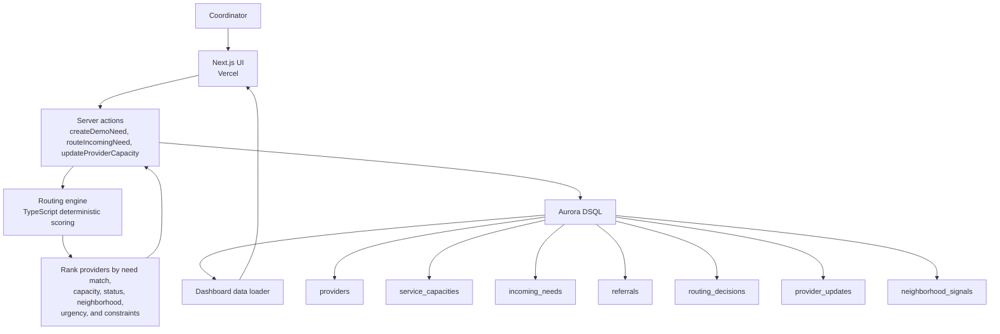
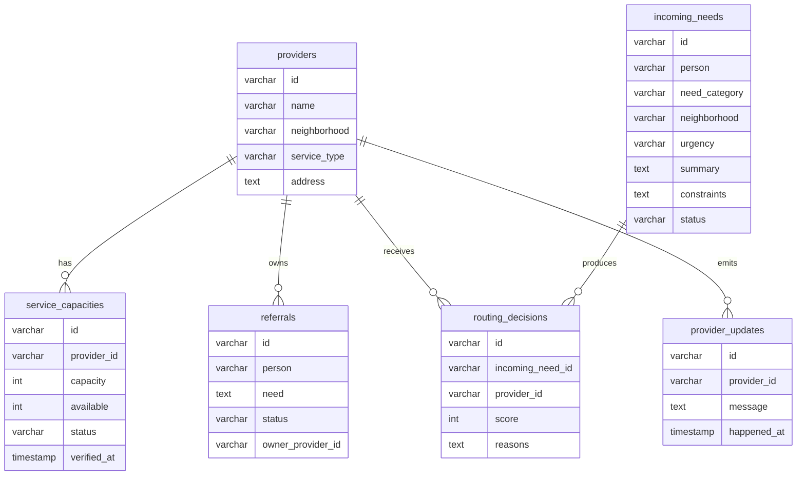

# Architecture

Civic Pulse is a serverless incident-routing workspace backed by Aurora DSQL. The app keeps the operational core simple: coordinators work in a Next.js UI, server actions apply deterministic routing and state changes, and DSQL stores every handoff.

## System diagram

## Request flow

1. A coordinator selects an `incoming_needs` record.
2. The app ranks providers using the deterministic routing engine.
3. The coordinator chooses a recommended provider or backup route.
4. `routeIncomingNeed` writes:
   - a `referrals` row
   - a `routing_decisions` row
   - a `provider_updates` audit row
   - an updated `incoming_needs.status`
   - an updated `service_capacities.available`
5. The page revalidates and reloads the latest DSQL-backed state.

## Why deterministic routing

The recommendation logic is intentionally explainable and low-cost. It does not require an always-on model, vector database, queue, or paid external API. This keeps the system appropriate for nonprofit and civic teams that need transparent decisions and predictable operating cost.

The routing engine can be extended later with optional intake parsing or geocoding, but the core handoff logic remains auditable.

## Deployment

- Frontend and server actions: Vercel
- Database: Aurora DSQL
- ORM: Drizzle
- Local fallback: built-in demo data via `CIVIC_PULSE_FORCE_DEMO=1`

## Data model

